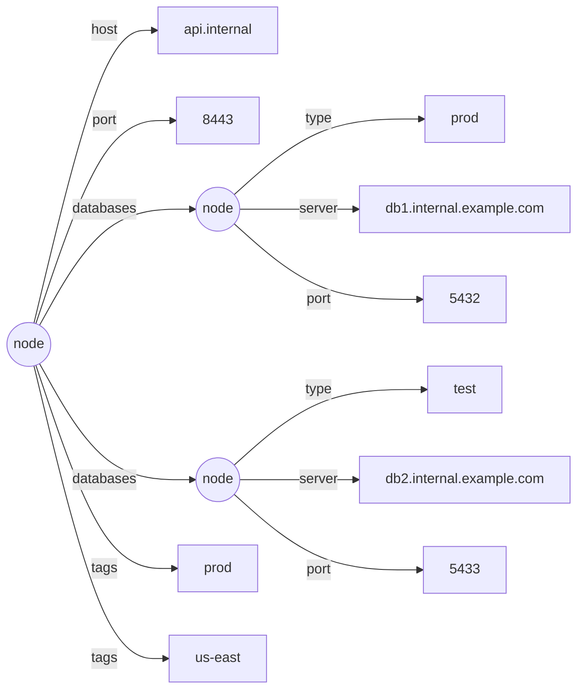
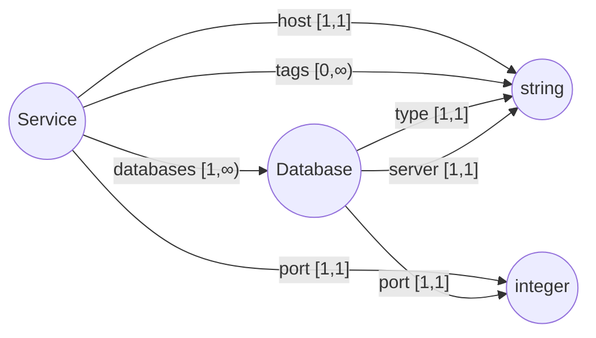

# Document & Schema Model

> The model is **inspired by** Lee & Cheung, *"XML Schema Computations"*
> (CIKM 2010) — but you don't need the paper to read this. The definitions
> below are self-contained and use plain terms (node, edge, label, value,
> field, cardinality, scalar).

## 1. Summary

This defines Omnist's two core models — the **Document** (the data) and the
**Schema** (the constraint) — as one small, format-independent formalism,
deliberately closed, for the JSON family of formats, so the schema operations in §9-§11 stay well-defined.

The headline ideas:

1. A **Document is an ordered list of labeled edges**, not a map whose values may be arrays.
2. A **Schema has exactly four building blocks** — `record` (constrained by its child labels), `Scalar` (one of seven fixed kinds, optionally nullable), `Ref` (naming and recursion), and `any` (a declared leaf whose value is unchecked — the model's one deliberate opening, added in v0.5.0). A field's type is always exactly one of these — never a composition.
3. **Field cardinality `[min,max]`** is the single mechanism for optional / required / array. There is no separate array type.
4. The model is **closed by default; open only where explicitly marked**: records are closed, scalar types are never composed into enums or unions, and there are no open objects, no maps, and no wildcard keys. The single sanctioned opening is `any` — a field-level top type that is grep-visible in the schema text, never chosen by the tool by default (`infer` never emits it unless you opt in with `--allow-any`, which reports every opening), and never opens the label alphabet the algebra reasons over. This discipline is what keeps `compatible_with`, `equivalent`, `normalize`, and `infer` well-defined, decidable operations — not a constraint imposed for its own sake. See [any-type-spec.md](any-type-spec.md) for the full design and [openness.md](openness.md) for why maps and open records remain refused.

---

## 2. Why the model looks this way

Three properties shape every other decision in this document:

- **The Document must faithfully represent every supported input.** XML may
  interleave repeated elements (`<member/><other/><member/>`); a map whose
  values are arrays (`{"member": […], "other": …}`) has already reordered
  that and cannot express the interleaving. So the Document is an *ordered
  list of edges*, not a map — it's canonical regardless of format, including
  XML's.
- **"How many times may this label appear, and what shape?" is one idea,
  expressed by one mechanism.** A field's `cardinality [min,max]` covers
  required, optional, and array in a single range, rather than splitting the
  question across several separate mechanisms that would each need their
  own rules (and their own edge cases to get wrong).
- **A schema should guarantee structure everywhere it doesn't explicitly
  opt out.** Every record is closed (§5); there is no open/wildcard record
  and no open-ended map type (§3). The one sanctioned opt-out is the `any`
  type (v0.5.0): a field may declare "no structure checked here," at a
  fixed, counted label, visible as a literal `any` token in the schema
  text — and the guarantee ends exactly there, stated rather than hidden
  (see [any-type-spec.md](any-type-spec.md)).

A field's type is also never a composition of several candidates (no enums,
no unions, no literal values in type position — §5). The reason: if a
field's type could be, say, "either an integer or the literal string
`unlimited`," a value that happens to match more than one candidate (or none
cleanly) leaves no principled way to pick which Python type to materialize
it as when deserializing (§10). A field's type is always exactly one fixed
scalar kind (optionally nullable) or one `Ref` to a record, so there's never
a choice to make.

---

## 3. Goals and non-goals

**Goals**
- One canonical Document model, format-independent, faithful to every supported input (including XML interleaving).
- A small, self-contained schema model that's closed by default (with `any` as its one explicit, demarcated opening) -- every operation over it (`validate`, `compatible_with`, `equivalent`, `normalize`, `infer`) has exactly one answer, never a best-effort guess.
- A clean formal definition both models can be specified and reasoned about from.

**Non-goals**
- **Maps / open key sets** (`{ [string]: T }`) and **wildcard / open records**
  — refused, not merely deferred: they would open the label alphabet the
  whole algebra reasons over. See [the openness decision
  record](openness.md) for the full argument. (`any`, by contrast, opens
  only a declared value at a fixed label — see [§1 above](#1-summary) and
  [any-type-spec.md](any-type-spec.md).)
- **Structural unions** (`{a}|{b}`), **value-domain unions/enums** (`"a" | "b"`), and **positional tuples** (`[string, integer]`) — not expressible (see §2 for why, on the value-domain side).
- **Constrained scalars** (e.g. `Email = string matching …`) — no value refinements yet.
- **Order-sensitive fields** — validation is order-free (see §4, §7).

---

## 4. Document model

A Document is a **node**: either a scalar value, or an ordered list of labeled edges.

```
value   = scalar  (string · integer · number · boolean · date · time · datetime)  |  null
edge    = (label: String, target)            where target = value | node
node    = [ edge, edge, … ]                  -- ordered; labels MAY repeat
Document = node                              -- (or a bare value at a leaf)
```
<!-- doc-illustrative -->

**Properties**

- **"Many" is a repeated label.** An array of `Database`s is the label `databases` occurring N times — not a field pointing to an array. JSON `{"databases":[A,B]}` and XML `<databases>A</databases><x/><databases>B</databases>` both become `[(databases,A), …, (databases,B)]`.
- **Object and array unify.** A node is just an ordered edge list; the object-vs-array distinction vanishes.
- **Order is preserved in the Document** (it is the canonical, faithful record) but is **data, never a schema constraint** (§7). A reordered round-trip remains schema-valid.

**Format mapping.** See [Formats](../formats/overview.md#how-a-format-becomes-a-document)
for the full table of how each supported format's constructs map onto this
Document shape.

This is the model-level shape; for the full formal grammar of OML — the
concrete syntax that maps onto it — see [the OML-Core grammar](oml-grammar.md).

---

## 5. Schema model

A **Schema** is `(root, env)`, where `root` is a `Ref` and `env` maps names to **record definitions**. There is exactly one definition kind: a **record**, which constrains a node by its child labels. A field's type is either a `Scalar` (one of seven fixed kinds, optionally nullable) or a `Ref` to a named record — never a composition of several candidates.

```
Schema      = root: Ref ;  env: Name ⇀ Record

Record  = { Field… }                         -- CLOSED: only these labels
Field   = (label: String, type: Type, cardinality: [min, max])
Type    = Scalar | Ref(Name)                 -- exactly one scalar kind, or a named record

Scalar  = (kind, nullable: bool)             -- kind ∈ { string, integer, number, boolean, date, time, datetime }
          -- exactly one of the seven fixed kinds; never composed with another kind or a literal value
```
<!-- doc-illustrative -->

**Rules**

- **Records are closed.** Any label not named by a field is invalid. (No wildcard.)
- **Cardinality is the *only* mechanism for multiplicity** — how many times a label may appear, order ignored: `[1,1]` required (default), `[0,1]` optional, `[0,∞]` array, `[1,∞]` non-empty array, `[2,5]` bounded. **There is no separate Array type** — array-of-record is `cardinality > 1` with a `Ref` item.
- **`?` applies to scalars only.** `string?` is a nullable `Scalar{string}`. It **cannot** apply to a `Ref`. "This record may be absent" is `cardinality [0,1]`, never `?` (see §6).
- **Records are always named and reached by `Ref`.** No inline/anonymous records — this makes the schema a graph of named definitions (so reuse and recursion are uniform), not a nested tree.
- **A `Scalar` is exactly one fixed kind, optionally nullable — never composed.** No enums, no literal values in type position, no combining two kinds.

**Surface syntax** (shorthands desugar to the model)

```
record Database {
    "type": string,                  -- Scalar{string}
    "server": string,
    "port": integer,
}
record Service {
    "host":            string,       -- cardinality [1,1] (default); Scalar{string}
    "port":            integer,
    "databases" [1,]:  Database,     -- cardinality [1,∞]; Ref(Database)
    "tags" [0,]:       string,       -- cardinality [0,∞]; Scalar{string}
}
root Service
```
<!-- doc-illustrative -->

- **Quoting rule:** `"quoted"` = a **data string** (a field label); an **unquoted identifier** = a **schema name** (a scalar kind or a `Ref`).
- `string?`, `integer?`, etc. are the nullable form of a scalar — the only suffix the grammar allows.
- `record` is the one naming keyword. ("type" is *not* a keyword — it would be ambiguous between "a definition", "the thing being named", and a record.)

This is the model-level shape; for the full formal grammar of the OSD
concrete syntax shown above, see
[the OSD grammar](schema-osd-grammar.md).

---

## 6. Two deliberate exclusions

Two things the model intentionally cannot express, and why:

- **A record-or-null field.** A field's type is *either* a scalar *or* a `Ref` to a record — never both at once. "This value is a string or null" is a nullable scalar (`string?`); "this subtree is a Manager record or a bare null" would need a type that is half scalar and half `Ref`, which the model doesn't allow. So `?` (which makes a *scalar* nullable) applies only to scalars, and "this record might not be here" is expressed by **cardinality `[0,1]`** (the field may be absent) — not by a nullable reference.
- **Maps / open key sets.** A record names every label it allows. An open-ended key set ("any string key, all of type T") would be a structureless hole, so it's deferred (§3). Use a named record when the keys are known; for genuinely open data, this is a future, opt-in feature.

---

## 7. Conformance (validation)

A node `n` conforms to a `Record R` iff:
1. **Cardinality** — for each field `(label, type, [m,k])`, the count of edges in `n` with that label is in `[m,k]`.
2. **Closedness** — every edge label in `n` is some field of `R`.
3. **Targets** — each matching edge's target conforms to that field's `type`.

A value conforms to a `Scalar` iff it matches the scalar's kind (or is `null` and the scalar is nullable). A target conforms to `Ref(N)` iff it conforms to `env[N]`. "Matches the scalar's kind" is defined precisely in §10 — validation only *checks* a match (it never converts a value); §10 also covers *deserialization*, which additionally converts a matching value to a canonical Python type.

**Order is ignored.** Cardinality counts edges; it never constrains their sequence. A JSON document and an interleaved XML document with the same edges (in any order) conform identically.

---

## 8. Serialization (Document → format)

Group all edges sharing a label into one key, regardless of position: `[(m,A),(x,X),(m,B)]` → `{"m":[A,B], "x":X}`. Within-label order (`A` before `B`) is preserved; cross-label interleaving is dropped (no JSON-family format can express it). See §9 (1) for the count-1 rule.

---

## 9. Resolved decisions

The corner cases, and how they're settled:

1. **Count-1 serialization → always-list, by design — writers never take a
   schema.** A single-element array can't be told apart from a single value
   from the Document alone (both are one edge), so a label seen exactly once
   always serializes as a bare value, and a label seen more than once always
   serializes as a list. None of the writers (`write_json`/`write_yaml`/
   `write_toml`/`write_xml`, or the matching `Doc.to_*` methods) accept a
   `schema=` parameter, and none will: a writer's job is to serialize the
   Document exactly as it is, not to consult a schema for how to shape the
   output. Schema awareness is one-directional, on the **read** side only —
   see [schema-directed deserialization](../deserialization.md), where
   `schema=` upgrades leaves (and *only* leaves) to match declared types.
   There is no plan to add a write-side equivalent.
2. **Array-of-scalar → a repeated label**, uniform with array-of-record (`"tags"[0,]: string`). One mechanism (cardinality) for all "many," matching XML's repeated elements.
3. **Bare nested arrays (`[[1,2],[3,4]]`) → forbidden for now.** Inner elements have no label, so there's no edge to give them (and XML can't express them either); reading one raises a clear error. Revisit only if a concrete need appears.
4. **Root → a `Ref` to a single record (single-rooted).** Guarantees a lossless XML round-trip (one document element) and keeps the entry point uniform with every other definition.

---

## 10. Scalar and Python type

A `Scalar`'s kind determines which Python type a conforming value is held as.
**Validation and deserialization use this mapping differently**, and the
difference is deliberate:

- **Validation** (`Schema.validate`) only *checks* whether a value already in
  the document — in whatever Python type it happens to be — matches a
  scalar's kind. It never converts anything.
- **Deserialization** (`materialize`, or `schema=` on a reader) additionally
  *converts* a matching value to the canonical Python type below, succeeding
  only when the conversion is **value-exact**, and raising `ParseError`
  otherwise. This is unambiguous by construction: a field has exactly one
  candidate scalar (§5), so there is never a choice between candidate
  representations — only "does this value exactly fit the one scalar
  declared, or not."

| Scalar kind | Canonical Python type | What validation accepts | What deserialization additionally converts | What deserialization rejects |
|---|---|---|---|---|
| `string` | `str` | any `str` | nothing (no other type converts to `str`) | every non-`str` value |
| `integer` | `int` | any `int` that isn't a `bool` | a `float` with no fractional part (`x.is_integer()`), e.g. `4.0 → 4` | `bool` (even though `bool` is an `int` subclass in Python); a `float` with a fractional part (`4.5`); any `str` |
| `number` | `float` | an `int` or a `float`, neither a `bool` | an `int` is **always** upgraded to `float` (`3 → 3.0`) — see note below | `bool`; any `str` |
| `boolean` | `bool` | any `bool` | nothing (no string `"true"`/`"false"` parsing) | every non-`bool` value |
| `date` | `datetime.date` | a real `date` that is **not** a `datetime` (see note below); or an ISO-8601 date string (`"2024-01-01"`) | the ISO-8601 date string, to a real `date` | a real `datetime` value (even though `datetime` is a `date` subclass); a string that isn't a valid bare ISO date |
| `time` | `datetime.time` | a real `time`; or an ISO-8601 time string (`"12:00:00"`) | the ISO-8601 time string, to a real `time` | a string that isn't a valid ISO time |
| `datetime` | `datetime.datetime` | a real `datetime`; or a full ISO-8601 timestamp string that is **not** also a bare date string | the timestamp string, to a real `datetime` | a bare ISO date string (`"2024-01-01"` alone never satisfies `datetime`, only `date`); a string that isn't a valid full timestamp |

Notes:

- **`bool` never satisfies `integer` or `number`.** Python's `bool` is an
  `int` subclass, so `isinstance(True, int)` is `True` — but a schema's
  `integer`/`number` scalar explicitly excludes it. `true`/`false` only ever
  satisfy `boolean`.
- **`number` always deserializes to `float`, even from an integer literal.**
  A JSON/YAML/TOML value `3` read against a `"v": number` field materializes
  as the Python `float` `3.0`, not the `int` `3` — `number` means "the
  `float` representation," and `integer` (`int`) is the one scalar kind that
  is a subset of it (the same subset relation `compatible_with`/`normalize`
  and `infer`, §11 step 2, use).
- **`datetime` is a subclass of `date` in Python**, and
  `datetime.fromisoformat` will happily parse a bare date string into a
  `datetime` at midnight — both are explicitly excluded so `date` and
  `datetime` stay mutually exclusive for *both* the real-object form and the
  string form. A bare date string only ever satisfies `date`; a real
  `datetime.datetime(2024, 1, 1)` (even at midnight) only ever satisfies
  `datetime`, never `date`.
- **Deserialization checks shape too, not just scalars.** Passing `schema=`
  is the request for a guaranteed-conforming Document: if a value's
  *structure* doesn't match what's expected (a record where a scalar is
  expected, or vice versa) or a field is missing/unexpected/repeated outside
  its cardinality, `materialize` raises `ParseError` for that too — the same
  checks `Schema.validate` performs, run in the same pass as the scalar
  conversions above, with every problem found (not just the first) collected
  into one error. There's no separate opt-in for this: a schema is either
  given, in which case the result is guaranteed to conform or an error is
  raised, or `schema=None`, in which case the node is returned exactly as
  read. `Schema.validate` still exists on its own, for validating a Document
  you didn't just deserialize.

## 11. Inference: determining a field's `Scalar` from samples

`infer(samples)` drafts a `Scalar` for each scalar-valued field as follows,
given the values observed across all samples for that field's label:

1. **Collect the kind of every non-`null` value**, using the same kind names
   as §10's table (a Python `bool` → `boolean`, an `int` → `integer`, a
   `float` → `number`, a `datetime.datetime` → `datetime`, a `datetime.date`
   → `date`, a `datetime.time` → `time`, anything else → `string`).
2. **Collapse `integer` into `number`** if both were observed — the one
   subset relation between scalars (every integer value is also a number).
   No other pair collapses.
3. **If more than one kind remains after the collapse, raise `SchemaError`.**
   A field can be inferred to exactly one scalar or not at all; e.g. samples
   with `1` and `"x"` for the same label raise, but `1` and `2.5` infer
   `number`.
4. **The field is `nullable` iff any sample's value was `null`.** This is
   fully orthogonal to step 1–3: a label with values `1`, `null` infers
   `integer?`, never raising on account of the `null`.
5. **If every observed value was `null`** (the label occurred in at least
   one sample, but never with a non-`null` value), there is no kind
   information to infer from. `infer` defaults to `Scalar("string",
   nullable=True)`. (A label that never occurs in *any* sample — including
   one that's always an empty array — gets no field at all; that's a
   property of the cardinality bookkeeping in §9(2), not of this algorithm,
   since this algorithm only ever runs for a label that occurred at least
   once.)

---

## 12. Satisfiability and pruning

Not every well-formed `Schema` describes at least one document. A record
requiring (`min >= 1`) a `Ref` to another record that in turn requires it
back — a mandatory ref cycle — has no base case: satisfying it would need
an infinitely deep document, which doesn't exist. Such a record is
**unsatisfiable**; a schema whose root is unsatisfiable accepts the
**empty language** (no document at all).

**Satisfiability** (`ops/prune.py`, `satisfiable_set`) is the least
fixpoint: a record is satisfiable iff every mandatory field (`min >= 1`) is
either a `Scalar` (always satisfiable) or a `Ref` to an already-satisfiable
record. Optional fields (`min == 0`) never block satisfiability — they
simply need not be emitted. This is the complement of the paper's "useless
/ irrational states": a record is useless (in the paper's sense) exactly
when it's unsatisfiable here.

**Why `compatible_with` needs this (Theorem 1 analog).** The paper's
Algorithm 4 (SubschemaSA) is coinductive: when comparing two schemas'
"states" (records) reachable through a matching sequence of fields, a
repeated pair is assumed compatible without further checking, on the
premise that an infinite matching sequence corresponds to an infinite
document that both schemas would accept identically. That premise silently
assumes every state involved is *reachable by some finite document* — i.e.
satisfiable. Run the coinductive rule on an unsatisfiable record without
that precondition and it produces a *false negative*: the cycle "matches
itself" structurally, so naive SubschemaSA says the record is compatible
with nothing outside the cycle, when the true answer is the opposite — an
unsatisfiable schema's language is empty, so it is *vacuously* a subschema
of everything. `ops/subschema.py` computes the A-side's satisfiable set
once per `compatible_with` call and treats an unsatisfiable A-side record
as trivially compatible (`_sub` returns `True` immediately), matching the
correct, vacuous truth rather than the naive coinductive answer.

**`prune()` <-> MakeUsefulSA.** The paper's MakeUsefulSA transforms an
automaton by removing every useless (here: unsatisfiable) state before
running SubschemaSA, so its coinductive rule's precondition always holds.
`Schema.prune()` is the direct analog over omnist's model: it removes
records unreachable from root, fields that can never be emitted (`max ==
0`), and optional fields whose declared type is unsatisfiable (never
actually emittable either, since the field would never validate) — then
re-derives reachability from the reduced field set, since dropping a field
can make a previously-reachable record unreachable in turn. The result is
always `equivalent` to the input (same set of accepted documents), and
`prune` is idempotent.

**The root-unsatisfiable case is a deliberate exception.** If pruning
`s.root` itself is unsatisfiable, `prune()` leaves that record's own fields
untouched (only the rest of the environment is reduced to what's reachable
from it). Field-pruning the root would strip out exactly the mandatory
fields that make it unsatisfiable, silently producing a *different*,
satisfiable schema — breaking the "prune preserves equivalence" guarantee
that's the point of the operation. This mirrors the paper's own treatment:
MakeUsefulSA modifies an automaton with an unsatisfiable start state rather
than rejecting it outright, and the automaton's unsatisfiability is itself
the meaningful fact being preserved, not an error condition to elide.

See [the schema doc](../schema.md#empty-schemas) for a worked example and
[the glossary](../glossary.md) for *satisfiable*/*empty schema*/*prune*.

---

## 13. Minimization and canonical form

`Schema.normalize()` (`ops/minimize.py`) is the paper's Algorithm 2
(MinimizeSA) — partition refinement, the same family of algorithm as DFA
minimization. It computes the **minimal** schema equivalent to its input:
the fewest possible env records, and that result is **canonical** — unique
up to record naming (paper Theorems 3-4; they transfer directly to
omnist's deterministic counting-language restriction, since determinism is
exactly what makes "same label leads to the same block" well-defined).

**`normalize()` <-> MinimizeSA.**

1. `s = prune(s)` — mandatory first step (Section 12's MakeUsefulSA
   analog). Minimization is only meaningful over a *useful* automaton:
   without pruning, two semantically-equal records could be kept apart by
   a never-emittable field or by one being unreachable, which would make
   the "minimal" result depend on incidental syntactic debris rather than
   the language the schema accepts.
2. **Initial partition**: env records are grouped by `local_signature`
   (`ops/signature.py`) — each field's `(label, min, max, shape)`, where
   `shape` is `("scalar", name, nullable)` or `("ref",)`; ref *target
   names* are deliberately excluded so records that turn out equivalent
   via differently-named targets still start in the same block.
3. **Refine**: repeatedly split any block containing two records that
   disagree, for some field label, on which *block* their ref-typed
   field's target currently belongs to. This is exactly Moore's-algorithm-
   style DFA state partitioning: two states (here, records) are
   equivalent iff every transition (here, ref field) leads to equivalent
   states, computed as a fixpoint over a monotonically-refining partition
   of a finite set — always terminates.
4. **Merge**: each stable block collapses to one representative — its
   lexicographically smallest member name, a deterministic tie-break, not
   part of the paper — and every ref (plus the root) is remapped to
   representatives.

**Design decision: field order does not distinguish records.**
`local_signature` sorts a record's fields by label rather than keeping
declaration order. `Record` fields are validated as an unordered labeled
set (Section 2/`schema.py`'s own docstring: "Validation ignores order"),
and OSD's printed field order is purely cosmetic — so two records
declaring the same fields in a different order accept exactly the same
documents and **must** land in the same partition block. Keying by
declaration order instead would be a real bug: it would incorrectly split
semantically-identical records and could prevent them from ever merging.
This is exercised by `tests/test_canonical.py`'s
`TestNormalizePartitionRefinement.test_field_order_does_not_split_a_block`.

**The unsatisfiable-root case.** Per Section 12, `prune()` deliberately
leaves an unsatisfiable root's own fields untouched — pruning them would
silently produce a different, satisfiable schema. Partition refinement
over that unsatisfiable core isn't meaningful (there's no "fewest records"
notion when the schema's language is empty), so `normalize()` special-
cases `is_empty()` and returns the pruned schema as-is.

**Behavior changes from the pre-#140 implementation** (a single syntactic
merge pass keyed by full structural identity, including ref target names):
unreachable env records are now dropped (previously survived, since the
old pass never looked at reachability); ref-chained duplicates and
mutually-recursive "twin" records now merge (previously never did, even
under repeated calls, since target-name-inclusive keying can never
recognize records as equivalent through an indirection); `max == 0`
fields and optional-but-unsatisfiable fields disappear via the mandatory
`prune()` step.

See [the schema doc](../schema.md#operations-compare-and-infer) for the
worked example and [the glossary](../glossary.md) for *normalize* /
*canonical form* / *minimal schema*.

---

## 14. Paper correspondence

Omnist's design is directly inspired by Lee & Cheung, *"XML Schema Computations: Schema Compatibility Testing and Subschema Extraction"* (CIKM 2010). The table below maps omnist concepts to their paper equivalents. See [`docs/paper/`](../../docs/paper) for the PDF.

| Omnist concept | Paper concept | Notes |
|---|---|---|
| `Document` | Data Tree | An ordered list of labeled edges, faithful to every format (including XML interleaving) |
| `Record` / environment `env` | SA state | A record defines constraints on a node's child labels |
| Cardinality `[min,max]` intervals | HLang (counting language) | Omnist's deterministic, finite-cardinality restriction of the paper's infinite HLang |
| `Scalar` | VDom (value domain) | One of seven fixed kinds (string, integer, number, boolean, date, time, datetime), optionally nullable |
| `prune()` | MakeUsefulSA (Algorithm 1) | Remove unsatisfiable (useless) records and unreachable definitions |
| `normalize()` | MinimizeSA (Algorithm 2) | Canonical minimal form via partition refinement (DFA minimization-style) |
| `equivalent()` | EquivalentSA (Algorithm 3) | Bidirectional subschema inclusion — two schemas accept identical documents |
| `compatible_with()` | SubschemaSA (Algorithm 4) | One-way subschema check — one schema's documents are a subset of the other's (backward-compatibility) |
| `extract()` | ExtractSubschema (Algorithm 5) | Extract minimal subschema for a given label set |

An alternative test oracle for equivalence is available in `ops/isomorphic.py`, which implements the Alg.-3-style minimize-and-isomorphism check (used only for test validation, not in production).

---

## Appendix: worked example

Schema:

```
record Database {
    "type":   string,
    "server": string,
    "port":   integer,
}
record Service {
    "host":            string,
    "port":            integer,
    "databases" [1,]:  Database,
    "tags" [0,]:       string,
}
root Service
```
<!-- doc-illustrative -->

Document (canonical edge list) for a service with two databases and two tags:

```
[ ("host", "api.internal"),
  ("port", 8443),
  ("databases", [ ("type","prod"), ("server","db1.internal.example.com"), ("port",5432) ]),
  ("databases", [ ("type","test"), ("server","db2.internal.example.com"), ("port",5433) ]),
  ("tags", "prod"),
  ("tags", "us-east") ]
```
<!-- doc-illustrative -->

- JSON projection: `{"host":"api.internal","port":8443,"databases":[{"type":"prod","server":"db1.internal.example.com","port":5432},{"type":"test","server":"db2.internal.example.com","port":5433}],"tags":["prod","us-east"]}`
- XML projection: `<host>…</host><port>…</port><databases>…5432…</databases><databases>…5433…</databases><tags>prod</tags><tags>us-east</tags>` (and an interleaved XML input round-trips through the *same* Document).
- Conformance: `databases` occurs twice ∈ `[1,∞]` ✓; each `databases` target conforms to `Database` ✓; `tags` occurs twice ∈ `[0,∞]` ✓; `host` once ∈ `[1,1]` ✓; `port` once ∈ `[1,1]` ✓; no unlisted labels ✓.

The same Document as a tree of labeled edges. The two `databases` edges (and
the two `tags` edges) each share one label — that repetition *is* the array;
there is no separate list node:


<!-- doc-illustrative -->

And the schema behind it, as a graph: every record is a state, and a
field is a labeled, cardinality-counted edge to another state (`databases`
and `tags` are both array cardinalities, but on different types — a Ref
and a Scalar — showing the same mechanism covers both):


<!-- doc-illustrative -->
