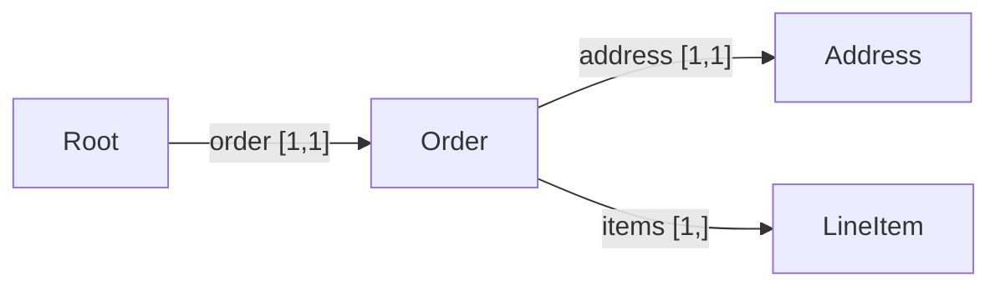

# A real-life example

One schema, one Document, validated against an order written in **OML**
(Omnist's own format -- see [the guide](guide.md#oml-the-native-format)).
The same Document also reads in from JSON, YAML, TOML, and XML.

For worked examples using real external formats rather than one designed
for Omnist, see the `examples/` directory (pyproject.toml, package.json, a
GitHub Actions workflow, sitemap.xml).

## The schema

An order: an id, a status, a total, a shipping address, one or more line
items, and an optional coupon. The whole thing sits under a single
top-level `order` key -- that makes it *single-rooted*, so the **same**
Document comes back from JSON, YAML, TOML, **and** XML (XML always has one
document element).

```
record Address  { "street": string, "city": string }
record LineItem { "sku": string, "qty": integer, "price": number }

record Order {
    "id":      string,
    "status":  string,
    "total":   number,
    "address": Address,
    "items" [1,]: LineItem,        # at least one line item
    "coupon" [0,1]: string,         # optional
}

record Root { "order": Order }      # single top-level key
root Root
```
<!-- doc-illustrative -->


<!-- doc-illustrative -->

The same schema with the builder functions:

```ts
import { schema, record, field, ref, t } from "@omnist-dev/omnist";

const address = record(field("street", t.string), field("city", t.string));
const lineItem = record(
  field("sku", t.string), field("qty", t.integer), field("price", t.number),
);
const order = record(
  field("id", t.string),
  field("status", t.string),
  field("total", t.number),
  field("address", ref("Address")),
  field("items", ref("LineItem"), 1, null),   // [1,]
  field("coupon", t.string, 0, 1),            // optional
);
const s = schema(ref("Root"), {
  Root: record(field("order", ref("Order"))),
  Order: order, Address: address, LineItem: lineItem,
});
```
<!-- verified-by: test/docs-example.test.ts::example schema validates the order document -->

## The order, in OML

```ts
import { parseSchema, readOml, Doc } from "@omnist-dev/omnist";

const s = parseSchema(SCHEMA); // the OSD above

const node = readOml(`
order: {
    id: "A1"
    status: "shipped"
    total: 42.50
    address: {
        street: "1 Main St"
        city: "Springfield"
    }
    items: {
        sku: "WIDGET-1"
        qty: 2
        price: 15.00
    }
    items: {
        sku: "GADGET-2"
        qty: 1
        price: 12.50
    }
}
`);
const d = new Doc(node);
s.validate(d).ok; // true
```
<!-- verified-by: test/docs-example.test.ts::example schema validates the order document -->

Note OML objects separate fields by newlines (or `;`), not commas -- a
comma is only used inside `[...]` array sugar. See
[the OML format page](formats/oml.md) for the full grammar.

## Translating to other formats

The same Document, once built, can be written to (or read from) any
registered format with `read*`/`write*`: `readJson`/`writeJson`,
`readYaml`/`writeYaml`, `readToml`/`writeToml`, `readXml`/`writeXml`. Each
format's own page documents what, if anything, it adjusts on the way in or
out -- see [Formats](formats/overview.md).
